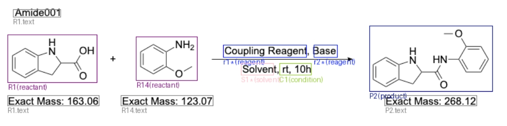

# CDXML Tools
`cdxml_tools` is based on pure Python. Parse `cdxml` with graphical recognition to get the path of the reaction, condition, and the role of compounds.

A hypothetical usage scenario is to generate automated chemical experiment workflows or generate natural language descriptions. You can export cdxml and svg content from ChemDraw. Use the tools to get reaction info and recognition image.



# Dependency[Optional]
The tool is based on pure Python. If you want the debug png feature. Need to install the following packages:
* Pillow
* wand

`wand` is a python binding from `imagemagick`. To install the package may need to install binary and set system env(see [wand doc](https://docs.wand-py.org/en)). The package is only used for converting svg to png.

# Input
The `cdxml` and `svg` content can export from ChemDraw `Selection` -> `Get CDXML` / `Get SVG`

# Quick Start
1. clone this repo
2. `make install`
3. see `tests/demo.ipynb`

# Usage
```python
from cdxml import buildCdxml, parseCdxml
parseResult, img = parseCdxml(
    cdxmlContent,
    svg=svgContent,
    withPosition=True,  # parse result will have every node's coord
    withCdxml=True,     # parse result will have compound's cdxml fragment
    withImg=True,       # parse result will have compound's svg fragment
)
```

# Others
The tools used the MIT license. Because the principle is a simple data converter. If you want to extend the feature or learn more about `cdxml`, highly recommend this article([CDXML format introduction](https://depth-first.com/articles/2021/04/07/an-introduction-to-the-chemdraw-cdxml-format/)). 

Also welcome to submit issue or pull request :)

# Contact
* me@lunzi.space